# Error Handling Architecture - A Progressive Guide

This guide demonstrates how to handle errors properly in a Clean Architecture application. We'll build a **Book Lending System** from scratch, starting with naive error handling and progressively improving it through multiple iterations.

## What You'll Learn

1. How each layer should define its own errors
2. How errors transform as they cross layer boundaries
3. How to maintain proper dependency direction
4. How to use guards and validation for defensive programming
5. How Effect's type system helps track all possible errors

---

## The Example: Book Lending System

We're building a simple API endpoint:

**`POST /books/:bookId/borrow`**

**Business Rules:**

- User must be registered and active
- Book must exist and be available
- User cannot borrow more than 3 books at once
- Borrowing records must be saved to database

**Flow:**

```
HTTP Request → Presentation Layer → Application Workflow → Domain Logic → Infrastructure (DB)
```

Let's build this system iteratively, improving the error handling at each step.

---

## Iteration 1: The Naive Approach (Problematic)

Let's start with how a beginner might implement this - mixing concerns and using generic errors everywhere.

### Domain Layer - Book Entity (Naive)

```typescript
// ❌ Problem: Using generic Error class
// ❌ Problem: No type safety for different error cases
// ❌ Problem: Mixing validation and business logic

class Book {
  constructor(
    public id: string,
    public title: string,
    public isAvailable: boolean
  ) {}

  static create(data: any): Book {
    // ❌ No validation
    return new Book(data.id, data.title, data.isAvailable);
  }

  borrow(): void {
    if (!this.isAvailable) {
      // ❌ Generic error - caller can't distinguish error types
      throw new Error("Book is not available");
    }
    this.isAvailable = false;
  }
}
```

### Repository (Naive)

```typescript
// ❌ Problem: Infrastructure errors leak to domain
// ❌ Problem: No proper error transformation

class BookRepository {
  async findById(id: string): Promise<Book | null> {
    try {
      const row = await db.query("SELECT * FROM books WHERE id = ?", [id]);
      if (!row) return null;
      return new Book(row.id, row.title, row.is_available);
    } catch (error) {
      // ❌ Database error exposed directly
      throw error;
    }
  }

  async save(book: Book): Promise<void> {
    try {
      await db.query("UPDATE books SET is_available = ? WHERE id = ?", [
        book.isAvailable,
        book.id,
      ]);
    } catch (error) {
      // ❌ No error transformation
      throw error;
    }
  }
}
```

### Workflow (Naive)

```typescript
// ❌ Problem: No input validation
// ❌ Problem: Business logic scattered
// ❌ Problem: Error handling is inconsistent

class BorrowBookWorkflow {
  constructor(
    private bookRepo: BookRepository,
    private userRepo: UserRepository,
    private lendingRepo: LendingRepository
  ) {}

  async execute(bookId: string, userId: string): Promise<void> {
    // ❌ No validation of inputs
    const book = await this.bookRepo.findById(bookId);
    if (!book) {
      throw new Error("Book not found");
    }

    const user = await this.userRepo.findById(userId);
    if (!user) {
      throw new Error("User not found");
    }

    // ❌ Business rule validation in workflow (should be in domain)
    const userBorrowings = await this.lendingRepo.countActiveByUser(userId);
    if (userBorrowings >= 3) {
      throw new Error("User has too many books");
    }

    // ❌ No error handling for borrow() failure
    book.borrow();

    await this.bookRepo.save(book);
    await this.lendingRepo.create({
      bookId,
      userId,
      borrowedAt: new Date(),
    });
  }
}
```

### Route Handler (Naive)

```typescript
// ❌ Problem: All errors become 500
// ❌ Problem: No proper error messages for client

app.post("/books/:bookId/borrow", async (req, res) => {
  try {
    const workflow = new BorrowBookWorkflow(bookRepo, userRepo, lendingRepo);
    await workflow.execute(req.params.bookId, req.body.userId);
    res.json({ success: true });
  } catch (error) {
    // ❌ Can't distinguish between error types
    // ❌ Always returns 500, even for client errors
    res.status(500).json({ error: error.message });
  }
});
```

### Problems with This Approach

1. **No Error Differentiation**: All errors are generic `Error` - can't tell if it's a validation error, not found, or database failure
2. **No Type Safety**: TypeScript can't help us handle all error cases
3. **Wrong HTTP Status**: Client errors (like "not found") return 500 instead of 404
4. **Leaked Infrastructure**: Database errors exposed directly to upper layers
5. **Business Logic in Wrong Place**: Validation scattered across layers
6. **No Input Validation**: Accepts any input without checking
7. **Poor Error Messages**: Generic messages not helpful to API consumers

**Let's fix these problems step by step!**

---

## Iteration 2: Add Proper Domain Errors (Better)

First improvement: Define specific error types in the domain layer.

### Step 1: Define Domain Errors

```typescript
import { Data } from "effect";

/**
 * ✅ Domain errors represent business rule violations
 * Each error type carries relevant context
 */

// Not found errors
export class BookNotFoundError extends Data.TaggedError("BookNotFoundError")<{
  readonly bookId: string;
}> {}

export class UserNotFoundError extends Data.TaggedError("UserNotFoundError")<{
  readonly userId: string;
}> {}

// Business rule violations
export class BookNotAvailableError extends Data.TaggedError(
  "BookNotAvailableError"
)<{
  readonly bookId: string;
  readonly title: string;
}> {}

export class BorrowLimitExceededError extends Data.TaggedError(
  "BorrowLimitExceededError"
)<{
  readonly userId: string;
  readonly currentCount: number;
  readonly maxAllowed: number;
}> {}

// Validation errors
export class BookValidationError extends Data.TaggedError(
  "BookValidationError"
)<{
  readonly message: string;
  readonly field?: string;
}> {}

export class UserValidationError extends Data.TaggedError(
  "UserValidationError"
)<{
  readonly message: string;
  readonly field?: string;
}> {}

// Infrastructure errors (from domain perspective)
export class RepositoryError extends Data.TaggedError("RepositoryError")<{
  readonly message: string;
  readonly operation: string;
}> {}
```

### Step 2: Update Book Entity with Validation

```typescript
import { Effect } from "effect";

/**
 * ✅ Book entity with validation and proper error types
 */
class Book {
  private constructor(
    public readonly id: string,
    public readonly title: string,
    public readonly isAvailable: boolean
  ) {}

  /**
   * ✅ Smart constructor with validation
   * Returns Effect that can fail with BookValidationError
   */
  static create(data: {
    id: string;
    title: string;
    isAvailable: boolean;
  }): Effect.Effect<Book, BookValidationError> {
    // Validate ID
    if (!data.id || data.id.trim() === "") {
      return Effect.fail(
        new BookValidationError({
          message: "Book ID is required",
          field: "id",
        })
      );
    }

    // Validate title
    if (!data.title || data.title.trim() === "") {
      return Effect.fail(
        new BookValidationError({
          message: "Book title is required",
          field: "title",
        })
      );
    }

    // ✅ Validation passed - create entity
    return Effect.succeed(new Book(data.id, data.title, data.isAvailable));
  }

  /**
   * ✅ Domain method with specific error type
   */
  borrow(): Effect.Effect<Book, BookNotAvailableError> {
    if (!this.isAvailable) {
      return Effect.fail(
        new BookNotAvailableError({
          bookId: this.id,
          title: this.title,
        })
      );
    }

    // ✅ Return new instance (immutable)
    return Effect.succeed(new Book(this.id, this.title, false));
  }

  returnBook(): Book {
    return new Book(this.id, this.title, true);
  }
}
```

### Step 3: Add User Entity with Business Rule

```typescript
/**
 * ✅ User entity with borrow limit validation
 */
class User {
  private constructor(
    public readonly id: string,
    public readonly name: string,
    public readonly isActive: boolean
  ) {}

  static create(data: {
    id: string;
    name: string;
    isActive: boolean;
  }): Effect.Effect<User, UserValidationError> {
    if (!data.id || data.id.trim() === "") {
      return Effect.fail(
        new UserValidationError({
          message: "User ID is required",
          field: "id",
        })
      );
    }

    if (!data.name || data.name.trim() === "") {
      return Effect.fail(
        new UserValidationError({
          message: "User name is required",
          field: "name",
        })
      );
    }

    return Effect.succeed(new User(data.id, data.name, data.isActive));
  }

  /**
   * ✅ Business rule: Check if user can borrow more books
   */
  canBorrowMoreBooks(
    currentBorrowCount: number
  ): Effect.Effect<void, BorrowLimitExceededError> {
    const MAX_BORROWS = 3;

    if (currentBorrowCount >= MAX_BORROWS) {
      return Effect.fail(
        new BorrowLimitExceededError({
          userId: this.id,
          currentCount: currentBorrowCount,
          maxAllowed: MAX_BORROWS,
        })
      );
    }

    return Effect.void;
  }
}
```

### Why This Is Better

1. **Specific Error Types**: Each error has its own type (`BookNotFoundError`, `BookNotAvailableError`, etc.)
2. **Rich Error Context**: Errors carry relevant data (bookId, title, current count, etc.)
3. **Type Safety**: Effect tracks all possible errors in function signatures
4. **Private Constructor & Smart Factory**: Constructor is `private`, forcing all entity creation through `create()` method which validates inputs. This prevents invalid entities from ever existing in your system.
5. **Validation in Domain**: Entities validate themselves on creation - you cannot bypass validation
6. **Business Rules in Domain**: `canBorrowMoreBooks` is in the User entity where it belongs
7. **Immutability**: Methods return new instances instead of mutating

### What's Still Missing

- Repository still doesn't use Effect
- Repository errors aren't transformed properly
- Workflow doesn't compose Effects properly
- Route handler can't distinguish error types yet

**Let's keep improving!**

---

## Iteration 3: Transform Infrastructure Errors (Even Better)

Now let's fix the Infrastructure layer to properly transform database errors into domain errors.

### Step 1: Repository with Error Transformation

```typescript
import { Effect, Option, pipe } from "effect";

/**
 * ✅ Repository that transforms infrastructure errors to domain errors
 */
class BookRepository {
  constructor(private db: Database) {}

  /**
   * ✅ Returns Option<Book> - None means not found
   * ✅ Transforms database errors to RepositoryError
   */
  findById(id: string): Effect.Effect<Option.Option<Book>, RepositoryError> {
    return pipe(
      Effect.tryPromise({
        try: () => this.db.query("SELECT * FROM books WHERE id = ?", [id]),
        // ✅ Transform database error to domain error
        catch: (error) =>
          new RepositoryError({
            message: `Database query failed: ${error}`,
            operation: "findById",
          }),
      }),
      Effect.flatMap((row) =>
        row
          ? pipe(
              // Use the smart constructor
              Book.create({
                id: row.id,
                title: row.title,
                isAvailable: row.is_available,
              }),
              // Wrap successful book in Option.some
              Effect.map(Option.some),
              // Transform validation error to repository error
              Effect.mapError(
                (e) =>
                  new RepositoryError({
                    message: `Invalid book data from database: ${e.message}`,
                    operation: "findById",
                  })
              )
            )
          : Effect.succeed(Option.none())
      )
    );
  }

  /**
   * ✅ Save with proper error handling
   */
  save(book: Book): Effect.Effect<void, RepositoryError> {
    return Effect.tryPromise({
      try: () =>
        this.db.query("UPDATE books SET is_available = ? WHERE id = ?", [
          book.isAvailable,
          book.id,
        ]),
      // ✅ Transform database error to domain error
      catch: (error) =>
        new RepositoryError({
          message: `Failed to save book: ${error}`,
          operation: "save",
        }),
    });
  }
}
```

### Step 2: User Repository

```typescript
class UserRepository {
  constructor(private db: Database) {}

  findById(id: string): Effect.Effect<Option.Option<User>, RepositoryError> {
    return pipe(
      Effect.tryPromise({
        try: () => this.db.query("SELECT * FROM users WHERE id = ?", [id]),
        catch: (error) =>
          new RepositoryError({
            message: `Database query failed: ${error}`,
            operation: "findById",
          }),
      }),
      Effect.flatMap((row) =>
        row
          ? pipe(
              User.create({
                id: row.id,
                name: row.name,
                isActive: row.is_active,
              }),
              Effect.map(Option.some),
              Effect.mapError(
                (e) =>
                  new RepositoryError({
                    message: `Invalid user data: ${e.message}`,
                    operation: "findById",
                  })
              )
            )
          : Effect.succeed(Option.none())
      )
    );
  }
}
```

### Step 3: Lending Repository

```typescript
interface LendingRecord {
  id: string;
  bookId: string;
  userId: string;
  borrowedAt: Date;
  returnedAt?: Date;
}

class LendingRepository {
  constructor(private db: Database) {}

  /**
   * ✅ Count active borrowings for a user
   */
  countActiveByUser(userId: string): Effect.Effect<number, RepositoryError> {
    return Effect.tryPromise({
      try: async () => {
        const result = await this.db.query(
          "SELECT COUNT(*) as count FROM lendings WHERE user_id = ? AND returned_at IS NULL",
          [userId]
        );
        return result.count;
      },
      catch: (error) =>
        new RepositoryError({
          message: `Failed to count borrowings: ${error}`,
          operation: "countActiveByUser",
        }),
    });
  }

  /**
   * ✅ Create new lending record
   */
  create(data: {
    bookId: string;
    userId: string;
    borrowedAt: Date;
  }): Effect.Effect<void, RepositoryError> {
    return Effect.tryPromise({
      try: () =>
        this.db.query(
          "INSERT INTO lendings (id, book_id, user_id, borrowed_at) VALUES (?, ?, ?, ?)",
          [crypto.randomUUID(), data.bookId, data.userId, data.borrowedAt]
        ),
      catch: (error) =>
        new RepositoryError({
          message: `Failed to create lending record: ${error}`,
          operation: "create",
        }),
    });
  }
}
```

### Why This Is Better

1. **✅ Error Transformation**: Database errors converted to domain `RepositoryError`
2. **✅ No Leaked Details**: Upper layers don't know about SQL, connection pools, etc.
3. **✅ Option Pattern**: `Option.none` for not found instead of null/undefined
4. **✅ Effect Composition**: All operations return Effects that can be composed
5. **✅ Validation**: Data from database validated through entity smart constructors

### What's Still Missing

- Workflow doesn't properly compose all these Effects
- No guards for defensive programming
- Route handler still can't map errors to HTTP codes

**Let's continue!**

---

## Iteration 4: Compose Workflow with Effect (Much Better)

Now let's build the workflow using proper Effect composition with `pipe`.

### Step 1: Add Input Validation Guards

```typescript
import { Schema as S } from "effect";

/**
 * ✅ Input validation schemas
 */
const BookIdSchema = S.String.pipe(
  S.minLength(1),
  S.pattern(/^[a-zA-Z0-9-]+$/)
);

const UserIdSchema = S.String.pipe(
  S.minLength(1),
  S.pattern(/^[a-zA-Z0-9-]+$/)
);

/**
 * ✅ DTO for borrow book request
 */
const BorrowBookInputSchema = S.Struct({
  bookId: BookIdSchema,
  userId: UserIdSchema,
});

type BorrowBookInput = S.Schema.Type<typeof BorrowBookInputSchema>;
```

### Step 2: Build Workflow with Proper Composition

```typescript
/**
 * ✅ Workflow that properly composes all Effects
 * Notice how errors from each layer bubble up naturally
 */
class BorrowBookWorkflow {
  constructor(
    private bookRepo: BookRepository,
    private userRepo: UserRepository,
    private lendingRepo: LendingRepository
  ) {}

  execute(input: unknown): Effect.Effect<
    { success: true; lendingId: string },
    | BookNotFoundError
    | UserNotFoundError
    | BookNotAvailableError
    | BorrowLimitExceededError
    | RepositoryError
    | S.ParseError // Schema validation error
  > {
    return pipe(
      // Step 1: Validate input
      S.decodeUnknown(BorrowBookInputSchema)(input),

      // Step 2: Load book and user in parallel
      Effect.flatMap((validInput) =>
        pipe(
          Effect.all({
            book: this.bookRepo.findById(validInput.bookId),
            user: this.userRepo.findById(validInput.userId),
            currentBorrowCount: this.lendingRepo.countActiveByUser(
              validInput.userId
            ),
          }),
          Effect.map((data) => ({ ...data, validInput }))
        )
      ),

      // Step 3: Handle Option.none cases
      Effect.flatMap(({ book, user, currentBorrowCount, validInput }) =>
        pipe(
          // Transform Option.none to error
          book,
          Option.match({
            onNone: () =>
              Effect.fail(new BookNotFoundError({ bookId: validInput.bookId })),
            onSome: (b) =>
              pipe(
                user,
                Option.match({
                  onNone: () =>
                    Effect.fail(
                      new UserNotFoundError({ userId: validInput.userId })
                    ),
                  onSome: (u) =>
                    Effect.succeed({ book: b, user: u, currentBorrowCount }),
                })
              ),
          }),
          Effect.flatten
        )
      ),

      // Step 4: Validate business rules
      Effect.flatMap(({ book, user, currentBorrowCount }) =>
        pipe(
          // Check if user can borrow more books
          user.canBorrowMoreBooks(currentBorrowCount),
          // Check if book is available
          Effect.flatMap(() => book.borrow()),
          // Pass along the borrowed book and user
          Effect.map((borrowedBook) => ({ borrowedBook, user }))
        )
      ),

      // Step 5: Save everything
      Effect.flatMap(({ borrowedBook, user }) =>
        pipe(
          // Save book state
          this.bookRepo.save(borrowedBook),
          // Create lending record
          Effect.flatMap(() =>
            this.lendingRepo.create({
              bookId: borrowedBook.id,
              userId: user.id,
              borrowedAt: new Date(),
            })
          ),
          // Return success response
          Effect.map(() => ({
            success: true as const,
            lendingId: crypto.randomUUID(),
          }))
        )
      )
    );
  }
}
```

### Why This Is Much Better

1. **Input Validation**: Schema validates input at the start
2. **Effect Composition**: All operations composed with `pipe` and `flatMap`
3. **Type-Safe Errors**: Effect signature lists ALL possible errors
4. **Parallel Operations**: Book and user loaded simultaneously
5. **Business Rules**: Domain methods (`canBorrowMoreBooks`, `borrow`) enforce rules
6. **Error Bubbling**: Errors flow up naturally without try-catch
7. **Defensive Programming**: Option.match handles missing data explicitly

### Error Flow Example

When a book is not available:

```
1. Input validated ✓
2. Book and user loaded ✓
3. Option.none checks pass ✓
4. user.canBorrowMoreBooks() passes ✓
5. book.borrow() fails → BookNotAvailableError
6. Error bubbles up through Effect chain
7. Workflow returns Effect.fail(BookNotAvailableError)
```

### What's Still Missing

- Route handler can't map domain errors to HTTP codes
- Need error mapper at presentation layer

**One more iteration!**

---

## Iteration 5: Map Errors to HTTP (Complete!)

Final step: Create error mapper at presentation layer and wire everything together.

### Step 1: HTTP Error Mapper

```typescript
/**
 * ✅ Presentation layer error mapper
 * Transforms domain/application errors to HTTP responses
 */
interface HttpErrorResponse {
  status: number;
  error: string;
  message: string;
  details?: Record<string, unknown>;
}

function mapErrorToHttp(
  error:
    | BookNotFoundError
    | UserNotFoundError
    | BookNotAvailableError
    | BorrowLimitExceededError
    | BookValidationError
    | UserValidationError
    | RepositoryError
    | S.ParseError
    | Error
): HttpErrorResponse {
  // Check if it's a tagged error
  if ("_tag" in error) {
    switch (error._tag) {
      // 404 Not Found
      case "BookNotFoundError":
        return {
          status: 404,
          error: "Not Found",
          message: `Book with ID ${error.bookId} not found`,
          details: { bookId: error.bookId },
        };

      case "UserNotFoundError":
        return {
          status: 404,
          error: "Not Found",
          message: `User with ID ${error.userId} not found`,
          details: { userId: error.userId },
        };

      // 409 Conflict - Business Rule Violations
      case "BookNotAvailableError":
        return {
          status: 409,
          error: "Conflict",
          message: `Book "${error.title}" is currently not available`,
          details: { bookId: error.bookId, title: error.title },
        };

      case "BorrowLimitExceededError":
        return {
          status: 409,
          error: "Conflict",
          message: `User has reached the maximum of ${error.maxAllowed} borrowed books (currently has ${error.currentCount})`,
          details: {
            userId: error.userId,
            currentCount: error.currentCount,
            maxAllowed: error.maxAllowed,
          },
        };

      // 400 Bad Request - Validation
      case "BookValidationError":
      case "UserValidationError":
        return {
          status: 400,
          error: "Bad Request",
          message: error.message,
          details: error.field ? { field: error.field } : undefined,
        };

      // 500 Internal Server Error - Infrastructure
      case "RepositoryError":
        return {
          status: 500,
          error: "Internal Server Error",
          message: "A database error occurred",
          // Don't expose internal details in production
          details:
            process.env.NODE_ENV === "development"
              ? { operation: error.operation, message: error.message }
              : undefined,
        };

      // 400 Bad Request - Schema validation
      case "ParseError":
        return {
          status: 400,
          error: "Bad Request",
          message: "Invalid request data",
          details: { errors: formatSchemaErrors(error) },
        };
    }
  }

  // Generic error fallback
  return {
    status: 500,
    error: "Internal Server Error",
    message: "An unexpected error occurred",
  };
}

/**
 * Helper to format schema validation errors
 */
function formatSchemaErrors(error: S.ParseError): string[] {
  // Simplified - in real app, traverse error tree
  return [error.message];
}
```

### Step 2: Route Handler with Error Mapping

```typescript
import { Effect, Runtime } from "effect";

/**
 * ✅ Route handler with proper error mapping
 */
app.post("/books/:bookId/borrow", async (req, res) => {
  const workflow = new BorrowBookWorkflow(bookRepo, userRepo, lendingRepo);

  // Create input from request
  const input = {
    bookId: req.params.bookId,
    userId: req.body.userId,
  };

  // Execute workflow Effect
  const result = await Runtime.runPromise(
    Effect.either(workflow.execute(input))
  );

  // Handle result
  if (result._tag === "Left") {
    // Error case - map to HTTP
    const httpError = mapErrorToHttp(result.left);
    res.status(httpError.status).json({
      error: httpError.error,
      message: httpError.message,
      details: httpError.details,
    });
  } else {
    // Success case
    res.status(200).json(result.right);
  }
});
```

### Step 3: Example Error Responses

**Book Not Found (404):**

```json
{
  "error": "Not Found",
  "message": "Book with ID book-123 not found",
  "details": {
    "bookId": "book-123"
  }
}
```

**Book Not Available (409):**

```json
{
  "error": "Conflict",
  "message": "Book \"The Great Gatsby\" is currently not available",
  "details": {
    "bookId": "book-456",
    "title": "The Great Gatsby"
  }
}
```

**Borrow Limit Exceeded (409):**

```json
{
  "error": "Conflict",
  "message": "User has reached the maximum of 3 borrowed books (currently has 3)",
  "details": {
    "userId": "user-789",
    "currentCount": 3,
    "maxAllowed": 3
  }
}
```

**Invalid Input (400):**

```json
{
  "error": "Bad Request",
  "message": "Invalid request data",
  "details": {
    "errors": ["bookId must match pattern [a-zA-Z0-9-]+"]
  }
}
```

**Database Error (500):**

```json
{
  "error": "Internal Server Error",
  "message": "A database error occurred"
}
```

### Why This Is Complete! 🎉

1. **Layer Separation**: Each layer defines its own errors
2. **Error Transformation**: Infrastructure → Domain → Application → HTTP
3. **Type Safety**: Effect tracks all possible errors
4. **Proper HTTP Codes**: 404 for not found, 409 for conflicts, 400 for validation, 500 for infrastructure
5. **Rich Context**: Errors carry relevant data for debugging
6. **Security**: Internal errors (database) don't leak details in production
7. **Maintainability**: Easy to add new error types

---

## Complete Error Flow Diagram



---

## Key Patterns and Guards

### Pattern 1: Smart Constructors (Guard at Entity Creation)

```typescript
// ✅ Validate data when creating entities
Book.create(data): Effect<Book, BookValidationError>

// Never allow invalid entities to exist
// const book = new Book(...) // ❌ Constructor is private
```

### Pattern 2: Option for "Not Found"

```typescript
// ✅ Use Option for queries that might not find data
findById(id): Effect<Option<Book>, RepositoryError>

// Transform Option.none to specific error
Option.match({
  onNone: () => Effect.fail(new BookNotFoundError({ bookId })),
  onSome: (book) => Effect.succeed(book)
})
```

### Pattern 3: Business Rules in Domain

```typescript
// ✅ Business logic lives in domain entities
user.canBorrowMoreBooks(count): Effect<void, BorrowLimitExceededError>

// NOT in workflow, NOT in repository
```

### Pattern 4: Error Transformation at Boundaries

```typescript
// ✅ Infrastructure transforms external errors
Effect.tryPromise({
  try: () => db.query(...),
  catch: (dbError) => new RepositoryError({ ... })
  // Database error never escapes
})
```

### Pattern 5: Effect Composition Over Try-Catch

```typescript
// ✅ Compose Effects with pipe
pipe(
  validateInput(input),
  Effect.flatMap(loadData),
  Effect.flatMap(validateBusinessRules),
  Effect.flatMap(save)
);

// ❌ Don't use try-catch
try {
  const data = await loadData();
  const valid = await validate(data);
  await save(valid);
} catch (e) {
  // Lost type information!
}
```

---

## Testing Each Layer's Error Handling

### Test 1: Domain Error - Borrow Unavailable Book

```typescript
describe("Book.borrow()", () => {
  it("should fail with BookNotAvailableError when book is not available", () => {
    // Arrange
    const book = Effect.runSync(
      Book.create({ id: "1", title: "Test", isAvailable: false })
    );

    // Act
    const result = Effect.runSync(Effect.either(book.borrow()));

    // Assert
    expect(result._tag).toBe("Left");
    expect(result.left).toBeInstanceOf(BookNotAvailableError);
    expect(result.left.bookId).toBe("1");
    expect(result.left.title).toBe("Test");
  });
});
```

### Test 2: Infrastructure Error - Database Failure

```typescript
describe("BookRepository.findById()", () => {
  it("should transform database error to RepositoryError", async () => {
    // Arrange
    const mockDb = {
      query: () => Promise.reject(new Error("Connection timeout")),
    };
    const repo = new BookRepository(mockDb);

    // Act
    const result = await Effect.runPromise(Effect.either(repo.findById("1")));

    // Assert
    expect(result._tag).toBe("Left");
    expect(result.left).toBeInstanceOf(RepositoryError);
    expect(result.left.operation).toBe("findById");
    expect(result.left.message).toContain("Connection timeout");
  });
});
```

### Test 3: Application Error - Borrow Limit

```typescript
describe("BorrowBookWorkflow", () => {
  it("should fail with BorrowLimitExceededError when user has 3 books", async () => {
    // Arrange
    const mockLendingRepo = {
      countActiveByUser: () => Effect.succeed(3), // User already has 3
    };
    const workflow = new BorrowBookWorkflow(
      mockBookRepo,
      mockUserRepo,
      mockLendingRepo
    );

    // Act
    const result = await Effect.runPromise(
      Effect.either(workflow.execute({ bookId: "1", userId: "user-1" }))
    );

    // Assert
    expect(result._tag).toBe("Left");
    expect(result.left).toBeInstanceOf(BorrowLimitExceededError);
    expect(result.left.currentCount).toBe(3);
    expect(result.left.maxAllowed).toBe(3);
  });
});
```

### Test 4: Presentation Error Mapping

```typescript
describe("mapErrorToHttp()", () => {
  it("should map BookNotFoundError to 404", () => {
    // Arrange
    const error = new BookNotFoundError({ bookId: "book-123" });

    // Act
    const httpError = mapErrorToHttp(error);

    // Assert
    expect(httpError.status).toBe(404);
    expect(httpError.error).toBe("Not Found");
    expect(httpError.message).toContain("book-123");
    expect(httpError.details?.bookId).toBe("book-123");
  });

  it("should map BorrowLimitExceededError to 409", () => {
    // Arrange
    const error = new BorrowLimitExceededError({
      userId: "user-1",
      currentCount: 3,
      maxAllowed: 3,
    });

    // Act
    const httpError = mapErrorToHttp(error);

    // Assert
    expect(httpError.status).toBe(409);
    expect(httpError.error).toBe("Conflict");
    expect(httpError.details?.currentCount).toBe(3);
  });

  it("should map RepositoryError to 500 and hide details in production", () => {
    // Arrange
    process.env.NODE_ENV = "production";
    const error = new RepositoryError({
      message: "SELECT failed on table books",
      operation: "findById",
    });

    // Act
    const httpError = mapErrorToHttp(error);

    // Assert
    expect(httpError.status).toBe(500);
    expect(httpError.error).toBe("Internal Server Error");
    expect(httpError.message).not.toContain("SELECT");
    expect(httpError.details).toBeUndefined(); // Hidden in production
  });
});
```

---

## Conclusion: Benefits of This Approach

### 1. Type Safety

```typescript
// Compiler forces you to handle all error cases
workflow.execute(input): Effect<
  Result,
  | BookNotFoundError      // Must handle
  | UserNotFoundError      // Must handle
  | BookNotAvailableError  // Must handle
  | BorrowLimitExceededError // Must handle
  | RepositoryError        // Must handle
  | ParseError             // Must handle
>
```

### 2. Clear Error Ownership

- **Domain**: Business rules (`BookNotAvailableError`, `BorrowLimitExceededError`)
- **Infrastructure**: Technical failures (`RepositoryError`)
- **Application**: Input validation (`ParseError`)
- **Presentation**: HTTP mapping (status codes)

### 3. No Error Leakage

```typescript
// ✅ Good: Infrastructure error transformed
catch: (dbError) => new RepositoryError({ ... })

// ❌ Bad: Infrastructure error leaked
catch: (dbError) => throw dbError
```

### 4. Testability

Each layer's errors can be tested in isolation:

- Domain: Unit tests for business rules
- Infrastructure: Mock database failures
- Application: Integration tests for workflows
- Presentation: Test HTTP status code mapping

### 5. Maintainability

Adding a new error type:

1. Define it in the appropriate layer
2. Add to Error union type
3. Add case to error mapper
4. TypeScript will catch any missing handlers!

---

## Summary

| Iteration             | What We Fixed         | Key Improvement               |
| --------------------- | --------------------- | ----------------------------- |
| **1. Naive**          | All generic `Error`   | ❌ Can't distinguish errors   |
| **2. Domain Errors**  | Added tagged errors   | ✅ Type-safe, specific errors |
| **3. Infrastructure** | Transform DB errors   | ✅ No leaked implementation   |
| **4. Workflow**       | Effect composition    | ✅ Composable, type-safe flow |
| **5. HTTP Mapping**   | Error to status codes | ✅ Proper HTTP responses      |

**Final Result**: A robust, type-safe error handling system where:

- Every error is properly typed
- Errors transform cleanly across layers
- HTTP responses match error semantics
- Tests can target specific scenarios
- Adding new errors is straightforward

The key insight: **Errors are values that flow through your system, not exceptions to be caught.** Effect's type system ensures you handle them correctly at every layer.
